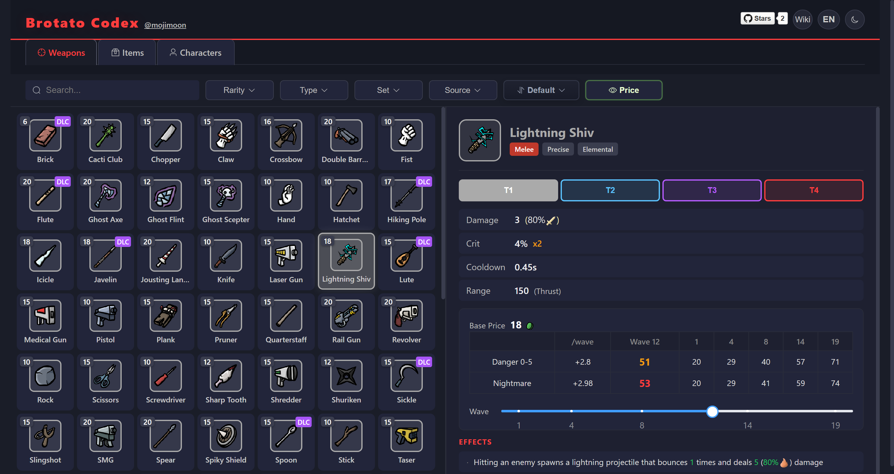

# Brotato Codex

[English](README.md) | [中文](README.zh.md)

## [Try it online](https://mojimoon.github.io/brotato/)

A web-based codex for [Brotato](https://store.steampowered.com/app/1942280/Brotato/), built from decompiled game data.



## Tech Stack

- **Data pipeline**: Python 3 — parses Godot `.tres` resource files, translates effect text, generates JSON + icon assets
- **Frontend**: Vue 3 + Element Plus + Vite (uses `pnpm`)
- **Styling**: Scoped CSS with dark/light theme toggle

## Setup & Usage

### Prerequisites

- [GDRE Tools](https://github.com/GDRETools/gdsdecomp/releases) to decompile the game
- Remember to choose "Add .pck" to decompile both the base game and DLC data at once

### Workflow

```bash
# 1. Decompile game with GDRE to a directory, e.g. D:\brotato\decompiled
#    The directory should contain: .assets/, weapons/, items/, dlcs/, effects/, etc.

# 2. Clone this repo into the decompiled directory
cd D:\brotato\decompiled
git clone https://github.com/mojimoon/brotato codex

# 3. Pre-analyze missing translations
cd codex/translations
python analyze.py
#    Outputs: codex/translations/merged_analysis.json

# 4. Start the translation fix web tool
pnpm install
pnpm dev
#    Opens at http://localhost:3000

# 5. In the web tool: load merged_analysis.json, match translations, export
#    Exported file goes to: codex/public/data/translations_merged.json

# 6. Generate the full game data
cd D:\brotato\decompiled
cd codex
python main.py
#    Outputs: codex/public/data/brotato_data.json
#             codex/public/icons/

# 7. Build the codex website
pnpm install
pnpm build
#    Output: codex/dist/
```

### Project Structure

```
root/
├── .assets/                  # Game resources (translations CSV, images, etc.)
├── weapons/                  # Base weapons (melee/, ranged/)
├── items/                    # Base items + characters
├── effects/                  # Effect class implementations
├── dlcs/dlc_1/               # DLC1 data
└── codex/                    # This repo
    ├── main.py               # Data pipeline: .tres → JSON + icons
    ├── public/data/
    │   ├── brotato_data.json        # Generated game data
    │   └── translations_merged.json # Manual translation fixes
    ├── src/App.vue           # Vue frontend
    └── translations/         # Translation fix toolchain
        ├── analyze.py        # Scans for missing translation keys
        └── web/              # Vue app for manual translation matching
```

## How It Works

### Data Pipeline (`main.py`)

1. Loads translations from `.assets/resources/translations/translations.csv` (base game) and `dlcs/dlc_1/translations/translations.csv` (DLC)
2. Optionally loads `translations_merged.json` for manually fixed entries
3. Parses every weapon, item, and character `.tres` file with a custom parser (not Godot runtime)
4. Renders effect text by replicating Godot's `Effect.get_text()` → `Text.text()` pipeline:
   - Resolves translation key (`text_key` or `key`, uppercased)
   - Builds args via each effect subclass's `get_args()` logic
   - Applies `custom_args` overrides (value, sign, format)
   - Formats with operator (+), percent (%), and color spans
5. Copies all referenced icon files to `public/icons/`

### Translation Fix Toolchain (`translations/`)

1. `analyze.py` scans all `.tres` effect files, extracts translation keys, cross-references with CSV, and outputs `merged_analysis.json` — a categorized list of missing keys with candidate strings
2. The web tool (`pnpm dev`) lets you visually match missing keys to translations and export a `translations_merged.json`
3. `main.py` picks up this file and fills in the gaps

## Technical Notes

### Cooldown Values

- `extra.spawn_cooldown` — already in seconds, do NOT divide by 60
- `structure_stats.cooldown` — in frames (60 fps), divide by 60
- `weapon_stats.cooldown` — in frames (60 fps), divide by 60

### Effect Rendering

- Two code paths exist: `_build_effect_args_and_signs()` (legacy) and `render_effect_text()` (active). Changes must be applied to both.
- `text_key = "[EMPTY]"` effects are filtered out entirely
- `stat_scaled = "different_item"` maps to `tr("ITEM")` (not `tr("DIFFERENT_ITEM")`)
- `spawn_cooldown = -1` is a sentinel meaning "use stats file cooldown"
- Icon syntax: `<icon>short_key</icon>` (e.g., `<icon>ranged_damage</icon>`) — Python generates it, Vue renders as ``
- Stat icon prefix: effects with `key` starting with `stat_` get an icon prefix; others get `・` for alignment

### Frontend

- Left panel: grid with `repeat(auto-fill, minmax(90px, 1fr))` layout
- Right panel: detail view with independent scroll
- Effect items use two flex children (`eff-prefix` + `eff-text`) to prevent line wrapping
- Theme toggle: `isDark` ref + `watch` adds `light-theme` class to `<html>` and `<body>`
- Tab icons: Aim (weapons), Box (items), User (characters) from `@element-plus/icons-vue`
- Language switch: el-dropdown with text content (not `:icon` prop, which requires a component)
- `html` must have same background as `body` to prevent color bleed on wide screens
