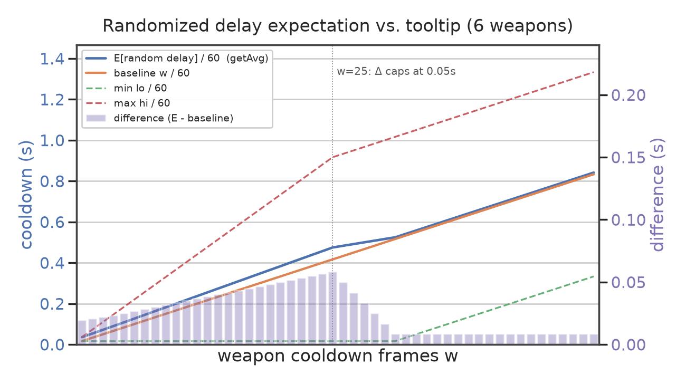

# A (99% Accurate) Detailed Explanation of Brotato's Weapon Cooldown Mechanics

**For precise cooldown calculations, we recommend using the Brotato Codex — [mojimoon.top](https://brotato.mojimoon.top/).**

## 0. Overview

$$\text{CD}_{\text{avg}} = T_{\text{attack interval (fixed)}} + C_{\text{delay frames (random)}}$$

The cooldown consists of the **recoil animation** and, for melee weapons only, the **swing animation**. These are affected by **attack speed** and **range**, and are **fixed**.

The delay frames $C$ are affected by the **number of weapons** and are **random**.

In the game, 1 second = 60 frames. Below, $t$ and $f$ denote durations expressed in seconds and frames, respectively.

## 1. Basic Information

**Attack speed factor** (stat attack speed % → decimal)

$$a=\frac{\%\text{Attack Speed}}{100}$$

**Cooldown frames (f)** (based on the weapon's base cooldown frames $w_{\text{base}}$; positive attack speed shortens it, negative attack speed lengthens it. Lower bound: 2 frames)

$$w = \max\Big(2,\;\Big\lfloor\begin{cases}\dfrac{w_{\text{base}}}{1+a}, & a\ge 0\\ w_{\text{base}}(1+|a|), & a<0\end{cases}\Big\rfloor\Big)$$

**Note: the displayed cooldown frames $w$ affect only the random delay frames $C$, not the fixed attack interval $T$.**

**Recoil duration (s)** (based on the weapon's base recoil duration $r_{\text{base}}$; positive attack speed shortens it, negative attack speed leaves it unchanged. Most weapons have $r_{\text{base}} = 0.1\text{s}$)

$$r=\begin{cases}\dfrac{r_{\text{base}}}{1+a}, & a\ge 0\\ r_{\text{base}}, & a<0\end{cases}$$

**Tween frame conversion (s→f)** (converts a duration in seconds into the actual number of frames the animation occupies)

$$\text{tween}(s) = \begin{cases}4, & s=0.05\\ \lfloor s \cdot 60\rfloor + 2, & \text{otherwise}\end{cases}$$

## 2. Ranged Weapons

A ranged weapon's cooldown consists only of two recoil animation segments (wind-up + wind-down).

**Recoil animation (f)**

$$f_\text{recoil} = 2 \cdot \text{tween}(r) - 1$$

**Attack interval (f)**

$$\boxed{f = 2 \cdot \text{tween}(r) - 1 + C}$$

Dividing by 60 gives the actual cooldown time (s).

**Tooltip displayed cooldown (s)**

$$\boxed{t_\text{tooltip} = 2r + \frac{w}{60}}$$

## 3. Melee Weapons

A melee weapon's cooldown consists of three animation segments (wind-up + swing + wind-down).

**Range factor** (proportional to weapon range. Positive attack speed $a$ reduces the range factor, down to a minimum of $\frac{7}{12}$ at +215 attack speed; negative attack speed does not increase the range factor)

$$\text{rangeFactor} = \frac{\text{max\_range}}{\text{clamp}\big(70(1+a/3),\;70,\;120\big)}$$

Here $\text{max\_range}$ is the weapon's range, equivalent to the weapon's base range plus half of the player's range stat. For example, with a base range of 150 and a player range stat of 100, $\text{max\_range} = 150 + 100/2 = 200$.

**Wind-up animation (s)**

$$t_\text{pre} = r$$

**Swing animation (s)** (split into two parts; higher attack speed and lower range factor make the swing shorter)

$$t_\text{atk} = \max\Big(0.01,\; 0.2 - \frac{a}{10}\Big) + \text{rangeFactor} \times 0.15$$

**Wind-down animation (s)** (base value 0.2s; positive attack speed shortens it, negative attack speed leaves it unchanged)

$$t_\text{back} = \frac{0.2}{1 + \max(0,a) \times 3}$$

**Attack interval (f)**

$$\boxed{f = \text{tween}(r) + \text{tween}(t_\text{back}) - 1 + \begin{cases} \text{tween}(\frac{t_\text{atk}}{2}), & \text{Thrust}\\ 2\text{tween}(\frac{t_\text{atk}}{4}), & \text{Sweep}\end{cases} + C}$$

Dividing by 60 gives the actual cooldown time (s).

For weapons that alternate between two attack styles, when $\text{tween}(\frac{t_\text{atk}}{2}) > 2\text{tween}(\frac{t_\text{atk}}{4})$, the cooldown lower bound is −2 frames and the mean is −1 frame.

**Tooltip displayed cooldown (s)**

$$\boxed{t_\text{tooltip} = r + t_\text{back} + \frac{t_\text{atk}}{2} + \frac{w}{60}}$$

## 4. Random Delay Frames

The random delay frames (f) are integers uniformly distributed between $\max(1, w - \Delta)$ and $w + \Delta$, where $\Delta = \min\Big(\frac{nw}{5},5n\Big)$ and $n$ is the number of weapons, capped at 6.

Taking the expectation of this uniform distribution gives the mean of $C$, denoted below as $\text{getAvg}$. The exact algorithm:

$$\text{tri}_v = \frac{v(v+1)}{2}$$

$$\text{getAvg}(\text{min}, \text{max}) = \frac{(\lceil\text{min}\rceil - \text{min})\lceil\text{min}\rceil + \text{tri}_{\lfloor\text{max}\rfloor} - \text{tri}_{\lceil\text{min}\rceil} + (\text{max} - \lfloor\text{max}\rfloor)\lceil\text{max}\rceil}{\text{max} - \text{min}}$$

The more weapons there are, the larger $\Delta$ becomes and the wider the random delay range, but it barely affects the mean (note that, because the lower bound is at least 1 frame, increasing the weapon count does slightly raise the mean when $w < 30$).

When $w \le 25$:

| $n$ | Lower bound | Upper bound |
| --- | --- | --- |
| 1 | $\max(1,\frac{4}{5}w)$ | $\frac{6}{5}w$ |
| 2 | $\max(1,\frac{3}{5}w)$ | $\frac{7}{5}w$ |
| 3 | $\max(1,\frac{2}{5}w)$ | $\frac{8}{5}w$ |
| 4 | $\max(1,\frac{1}{5}w)$ | $\frac{9}{5}w$ |
| 5 | $1$ | $2w$ |
| 6 | $1$ | $\frac{11}{5}w$ |

When $w > 25$:

| $n$ | Lower bound | Upper bound |
| --- | --- | --- |
| 1 | $w - 5$ | $w + 5$ |
| 2 | $w - 10$ | $w + 10$ |
| 3 | $w - 15$ | $w + 15$ |
| 4 | $w - 20$ | $w + 20$ |
| 5 | $w - 25$ | $w + 25$ |
| 6 | $\max(1, w - 30)$ | $w + 30$ |

Finally, the minimum and maximum delay frames (f) are:

$$\boxed{C_\text{min} = \lfloor\max(1, w - \Delta)\rfloor + 1}$$

$$\boxed{C_\text{max} = \lceil w + \Delta\rceil}$$

From the above calculations we can see that, because (i) the time occupied by the animations $\text{tween}(f)$ is always 1–2 frames more than the $\frac{f}{60}$ used by the tooltip, and (ii) the mean of the random cooldown frames is always slightly higher than the $\frac{w}{60}$ used by the tooltip, the tooltip's displayed cooldown is an underestimate. Typically a ranged weapon differs by 1–3 frames, a melee weapon by 2–5 frames, and the random frames differ by roughly 0.5–3.5 frames (0.0833–0.5833s, refer to the figure below), though these can vary further with other variables.

## 5. Worked Examples

All of the following assume 6 weapons.

| Weapon | Type | $w_\text{base}$ | $r_\text{base}$ | Range | Attack style |
| --- | --- | --- | --- | --- | --- |
| SMG T1 | Ranged | 4 | 0.05 | 400 | - |
| Hatchet T1 | Melee | 9 | 0.1 | 125 | Sweep |

SMG T1

- Cooldown frames $w = \lfloor\frac{4}{1}\rfloor = 4$ f
- Recoil duration $r = \frac{0.05}{1} = 0.05$ s, $\text{tween}(r) = 4$ f
- Recoil animation $f_\text{recoil} = 2 \times 4 - 1 = 7$ f
- Random distribution $\Delta = \min(\frac{6 \times 4}{5}, 5 \times 6) = 4.8$
    - $C \sim \mathcal{U}(\max(1, -0.8), 8.8) = \mathcal{U}(1, 8.8)$ f
    - Minimum $\text{min} = 7 + \lfloor 1 \rfloor + 1 = 9$ f
    - Maximum $\text{max} = 7 + \lceil 8.8 \rceil = 16$ f
    - Mean $\bar{C} = \text{getAvg}(1, 8.8) = 5.410$ f
- Mean cooldown $\bar{f} = 7 + 5.410 = 12.410$ f $\rightarrow 0.2068$ s
- Game display $t_\text{tooltip} = 2 \times 0.05 + \frac{4}{60} = 0.17$ s

SMG T1 (+1% attack speed)

- Cooldown frames $w = \lfloor\frac{4}{1.01}\rfloor = 3$ f
- Recoil duration $r = \frac{0.05}{1.01} = 0.0495$ s
    - $\text{tween}(r) = \lfloor 0.0495 \times 60\rfloor + 2 = 4$ f
- Recoil animation $f_\text{recoil} = 2 \times 4 - 1 = 7$ f
- Random distribution $\Delta = \min(\frac{6 \times 3}{5}, 5 \times 6) = 3.6$
    - $C \sim \mathcal{U}(1, 6.6)$ f
    - Minimum $\text{min} = 7 + \lfloor 1 \rfloor + 1 = 9$ f
    - Maximum $\text{max} = 7 + \lceil 6.6 \rceil = 14$ f
    - Mean $\bar{C} = \text{getAvg}(1, 6.6) = 4.321$ f
- Mean cooldown $\bar{f} = 7 + 4.321 = 11.321$ f $\rightarrow 0.1887$ s
- Game display $t_\text{tooltip} = 2 \times 0.0495 + \frac{3}{60} = 0.15$ s

SMG T1 (-50% attack speed)

- Cooldown frames $w = \lfloor 4 \times (1 + 0.5)\rfloor = 6$ f
- Recoil duration $r = 0.05$ s, $\text{tween}(r) = 4$ f
- Recoil animation $f_\text{recoil} = 2 \times 4 - 1 = 7$ f
- Random distribution $\Delta = \min(\frac{6 \times 6}{5}, 5 \times 6) = 7.2$
    - $C \sim \mathcal{U}(1, 13.2)$ f
    - Minimum $\text{min} = 7 + \lfloor 1 \rfloor + 1 = 9$ f
    - Maximum $\text{max} = 7 + \lceil 13.2 \rceil = 21$ f
    - Mean $\bar{C} = \text{getAvg}(1, 13.2) = 7.606$ f
- Mean cooldown $\bar{f} = 7 + 7.606 = 14.606$ f $\rightarrow 0.2433$ s
- Game display $t_\text{tooltip} = 2 \times 0.05 + \frac{6}{60} = 0.20$ s

Hatchet T1

- Cooldown frames $w = \lfloor\frac{9}{1}\rfloor = 9$ f
- Recoil duration (wind-up animation) $r = \frac{0.1}{1} = 0.1$ s
    - $\text{tween}(r) = \lfloor 0.1 \times 60\rfloor + 2 = 8$ f
- Range factor $\text{rangeFactor} = \frac{125}{70} = 1.7857$
- Swing animation $t_\text{atk} = \max(0.01, 0.2 - 0) + 1.7857 \times 0.15 = 0.2 + 0.2679 = 0.4679$ s
    - $\text{tween}(\frac{t_\text{atk}}{4}) = \lfloor 0.4679/4 \times 60\rfloor + 2 = 9$ f
- Wind-down animation $t_\text{back} = \frac{0.2}{1 + 0} = 0.2$ s
    - $\text{tween}(t_\text{back}) = \lfloor 0.2 \times 60\rfloor + 2 = 14$ f
- Attack interval $f = 8 + 14 + 2 \times 9 - 1 = 39$ f
- Random distribution $\Delta = \min(\frac{6 \times 9}{5}, 5 \times 6) = 10.8$
    - $C \sim \mathcal{U}(1, 19.8)$ f
    - Minimum $\text{min} = 39 + \lfloor 1 \rfloor + 1 = 41$ f
    - Maximum $\text{max} = 39 + \lceil 19.8 \rceil = 59$ f
    - Mean $\bar{C} = \text{getAvg}(1, 19.8) = 10.904$ f
- Mean cooldown $\bar{f} = 39 + 10.904 = 49.904$ f $\rightarrow 0.8317$ s
- Game display $t_\text{tooltip} = 0.1 + 0.2 + 0.4679/2 + \frac{9}{60} = 0.68$ s

Hatchet T1 (+1% attack speed)

- Cooldown frames $w = \lfloor\frac{9}{1.01}\rfloor = 8$ f
- Recoil duration (wind-up animation) $r = \frac{0.1}{1.01} = 0.099$ s
    - $\text{tween}(r) = 7$ f
- Range factor $\text{rangeFactor} = \frac{125}{70(1+0.01/3)} = 1.7798$
- Swing animation $t_\text{atk} = \max(0.01, 0.2 - 0.01/10) + 1.7798 \times 0.15 = 0.199 + 0.2669 = 0.4659$ s
    - $\text{tween}(\frac{t_\text{atk}}{4}) = 8$ f
- Wind-down animation $t_\text{back} = \frac{0.2}{1 + 0.01 \times 3} = 0.1941$ s
    - $\text{tween}(t_\text{back}) = 13$ f
- Attack interval $f = 7 + 13 + 2 \times 8 - 1 = 35$ f
- Random distribution $\Delta = \min(\frac{6 \times 8}{5}, 5 \times 6) = 9.6$
    - $C \sim \mathcal{U}(1, 17.6)$ f
    - Minimum $\text{min} = 35 + \lfloor 1 \rfloor + 1 = 37$ f
    - Maximum $\text{max} = 35 + \lceil 17.6 \rceil = 53$ f
    - Mean $\bar{C} = \text{getAvg}(1, 17.6) = 9.807$ f
- Mean cooldown $\bar{f} = 35 + 9.807 = 44.807$ f $\rightarrow 0.7468$ s
- Game display $t_\text{tooltip} = 0.099 + 0.1941 + 0.4659/2 + \frac{8}{60} = 0.66$ s

Hatchet T1 (+1% attack speed +1 range)

- Cooldown frames $w = 8$ f
- Recoil duration (wind-up animation) $r = 0.099$ s, $\text{tween}(r) = 7$ f
- Range factor $\text{rangeFactor} = \frac{125.5}{70(1+0.01/3)} = 1.7869$
- Swing animation $t_\text{atk} = \max(0.01, 0.2 - 0.01/10) + 1.7869 \times 0.15 = 0.467$ s
    - $\text{tween}(\frac{t_\text{atk}}{4}) = 9$ f
- Wind-down animation $t_\text{back} = 0.1941$ s, $\text{tween}(t_\text{back}) = 13$ f
- Attack interval $f = 7 + 13 + 2 \times 9 - 1 = 37$ f
- Random distribution $\Delta = \min(\frac{6 \times 8}{5}, 5 \times 6) = 9.6$
    - $C \sim \mathcal{U}(1, 17.6)$ f
    - Minimum $\text{min} = 37 + \lfloor 1 \rfloor + 1 = 39$ f
    - Maximum $\text{max} = 37 + \lceil 17.6 \rceil = 55$ f
    - Mean $\bar{C} = \text{getAvg}(1, 17.6) = 9.807$ f
- Mean cooldown $\bar{f} = 37 + 9.807 = 46.807$ f $\rightarrow 0.7801$ s
- Game display $t_\text{tooltip} = 0.099 + 0.1941 + 0.467/2 + \frac{9}{60} = 0.68$ s

| Weapon | Atk speed | Range | Mean CD (s) | Game display (s) | Min - Max range (f) | DPS diff |
| --- | --- | --- | --- | --- | --- | --- |
| SMG T1 | 0% | 0 | 0.2068 | 0.17 | 9 - 16 | - |
| SMG T1 | +1% | 0 | 0.1887 | 0.15 | 9 - 14 | +9.6% |
| SMG T1 | -50% | 0 | 0.2433 | 0.20 | 9 - 21 | -15.2% |
| Hatchet T1 | 0% | 0 | 0.8317 | 0.68 | 41 - 59 | - |
| Hatchet T1 | +1% | 0 | 0.7468 | 0.66 | 37 - 53 | +11.4% |
| Hatchet T1 | +1% | +1 | 0.7801 | 0.68 | 39 - 55 | +6.6% |

The benefit of attack speed is hard to analyze qualitatively, but for the vast majority of weapons the positive attack speed gain shows no obvious diminishing returns (+100% attack speed generally yields a +80% ~ +110% DPS gain, and +200% attack speed generally yields a +140% or greater DPS gain — this does not apply to SMGs or faster ranged weapons, which have clear attack speed breakpoints), while the penalty for negative attack speed is not very severe (at -100% attack speed, DPS change is generally between -50% and -20%).

As for the effect of range on melee weapons, a +200 range stat leads to a DPS change of -4% ~ -14%, while a -200 range stat yields a +5% ~ +20% DPS gain.

**For precise cooldown calculations, we recommend using the Brotato Codex — [mojimoon.top](https://brotato.mojimoon.top/).**
